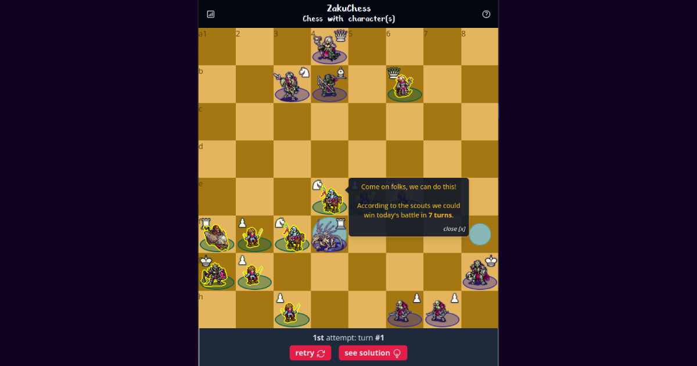

# Zakuchess


### Chess with character(s)

A free and open-source "daily chess challenge" game, where you play against a computer opponent
with pixel art units.

No tracking, no ads - it was built purely for fun, and to check how far I could go with 
a reactive User Interface powered by [htmx](https://htmx.org/) 🙂



### The stack

 - Programming language: [Python](https://www.python.org/)
 - Web framework: [Django](https://www.djangoproject.com/)
 - Database: [SQLite](https://www.sqlite.org/index.html)
 - Live user interface: [htmx](https://htmx.org/)
 - HTML templating: [DOMinate](https://github.com/Knio/dominate#readme)
 - CSS framework: [Tailwind CSS](https://tailwindcss.com/)
 - TypeScript compilation: [esbuild](https://esbuild.github.io/)
 - Units art: [The Battle for Wesnoth](https://www.wesnoth.org/) :shield:
 - Chess logic on the server: [python-chess](https://python-chess.readthedocs.io/en/latest/)
 - Chess logic in the browser: [Lozza](https://github.com/op12no2/lozza)
 - Tests suite: [pytest](https://docs.pytest.org/en/latest/)
 - Hosting: [Fly.io](https://fly.io/)

### Running locally

Make sure you have Python 3.11 installed, as well as Node.js v18.

We recommend [pyenv](https://github.com/pyenv/pyenv-installer#readme) and [nvm](https://github.com/nvm-sh/nvm#readme) to handle specific versions of Python and Node.js,
but you can of course use whatever you want :-)

```bash
$ python -V
Python 3.11.x # <-- check that you get this output 🙂
$ node -v
v18.x.x # ditto
```

Once you have these two installed, you can clone the repository and install the dependencies:

```bash
$ make install
$ make dev
```

You can take a look at [the Makefile](./Makefile) to see more commands.

### Roadmap

The roadmap now lives in a GitHub project:  
> https://github.com/users/olivierphi/projects/1/views/1

### Contributing

Improvements and bugfixes are welcome, but also new "daily challenges"!

When playing chess online with other people, if you find yourself in a position that you think 
could be interesting for others to try to solve ♞, please feel free to open an issue to discuss its
addition to the daily challenges database. 🙂

### About the chess engine used in the browser for the solution and the bot's moves

As a first iteration we were using [Stockfish](https://stockfishchess.org/) 
(compiled in WebAssembly by the wonderful folks at [Lichess](https://github.com/lichess-org) 💙)
for the chess logic in the browser.  
It plays well, it's fast, it's great.

However, for some reason we couldn't make it deterministic enough for the daily challenges:
during the games we were simulating in the Django Admin in order to determine the solution of a daily challenge,
the bot was playing different moves than what it would play plater against a real human player, 
which defeats the whole purpose of such a solution 😔  
Various solutions were tried (including using 2 distinct Workers for the simulated human
player and the bot one, so that the deeper analysis of the former doesn't impact the output of the
latter), but in the end Stockfish kept playing slightly different moves than what it would
player later on in real conditions against a real human player. 🤷

We switched to [Lozza](https://github.com/op12no2/lozza) for now, which is sadly more resource-intensive for the player's device.  
We may give another go at Stockfish later on, the code that uses it is still in place. 🤞


### License

This project is licensed under the GNU General Public License v3 - see the [LICENSE](./LICENSE) file for details.
